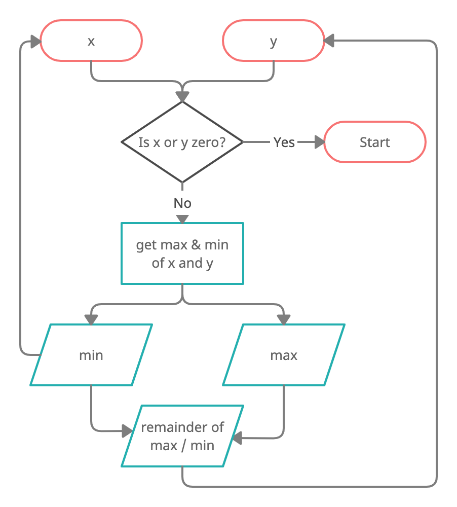
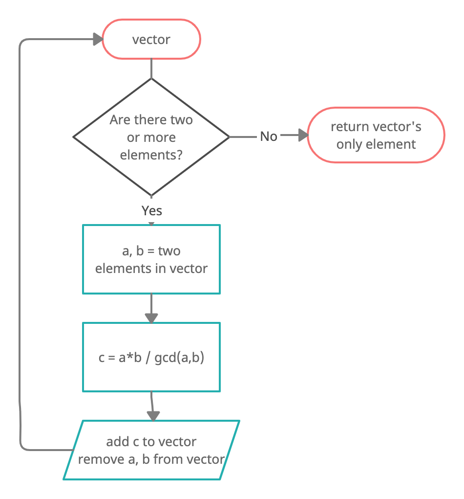
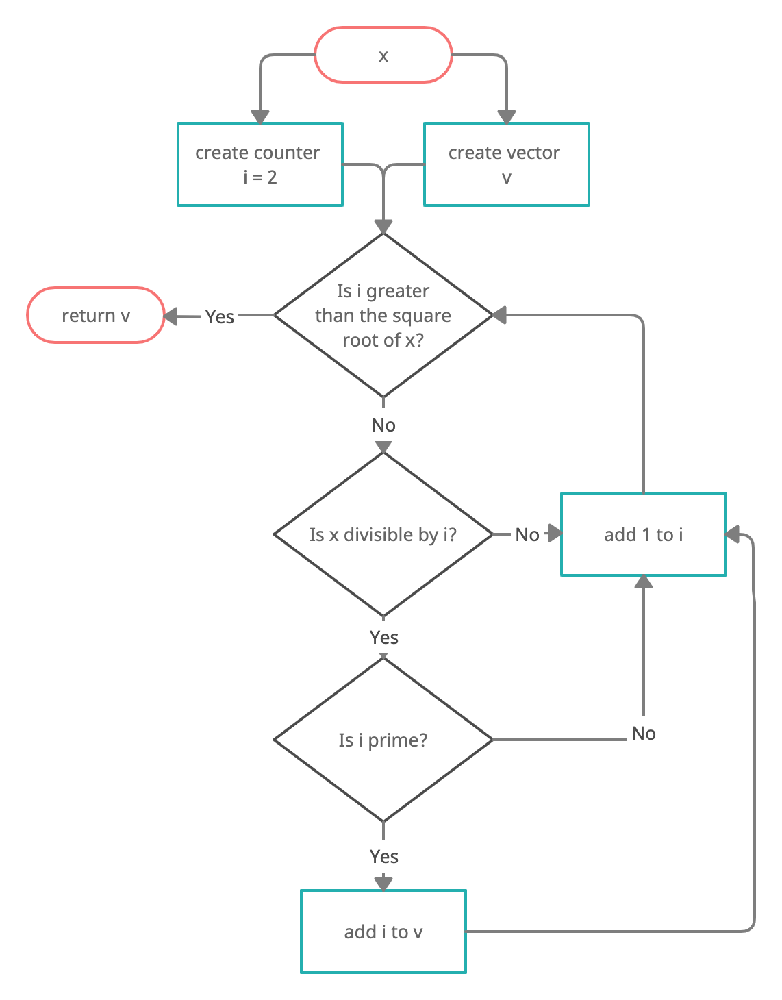

```{r}
source("105195172_stats102a_hw1.R")
```
## Problem 1

{width=50%}

Pseudocode for gcd(). Note GCD(a, b) = GCD(b, c) for c is remainder of a/b.
```{r, eval = FALSE}
gcd(x, y):
  let a = larger of x, y
  let b = smaller of x, y
  let c = remainder of a/b
  return gcd(b, c)
```

{width=50%}

\newpage
Pseudocode for lcm(). Note LCM(a, b, c) = LCM(LCM(a, b), c).
```{r, eval = FALSE}
lcm(nums):
  while length of nums >= 2:
      least = product of first two elements / gcd of first two elements
      remove first two elements of nums
      add least to nums
  return only element of nums
```
\newpage
## Problem 2

{width=50%}

Pseudocode for get_factors()
```{r, eval = FALSE}
get_factors(x):
  init empty vector v
  for i = 2 to sqrt(x):
    if remainder of x/i is 0 AND i is prime:
      add i to v
  return v
```

Pseudocode for is_prime(x)
```{r, eval = FALSE}
is_prime(x):
  if x is 0 or 1:
    return false
  for i = 2 to sqrt(n):
    if remainder of x/i is 0:
      return false
  return true
```

\newpage
## Test Cases
```{r, error=TRUE}
gcd(72, 8)
gcd(12, 640)
gcd(-1, 531)
gcd(47011, 73618)
lcm(c(12, 21))
lcm(c(4789, 6123, 199))
get_factors(1920)
get_factors(1.92)
get_factors(-19)
is_prime(9)
is_prime(c(2, 81, 13, 11, 109, 0, -1))
```

